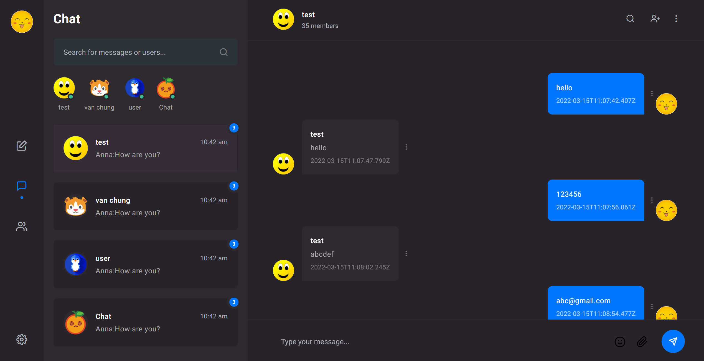
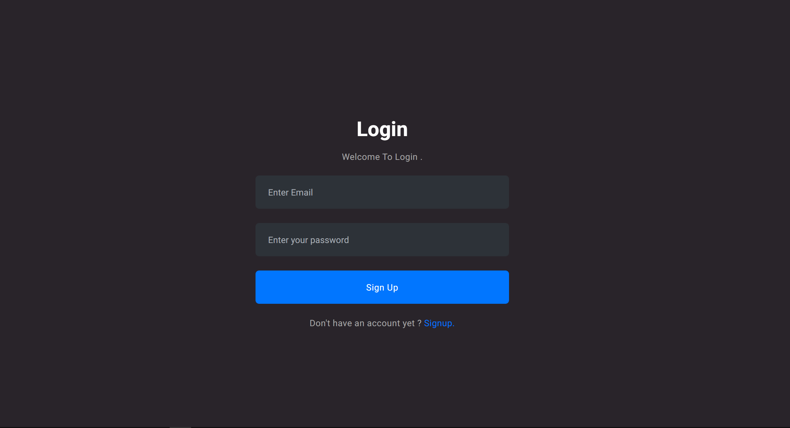
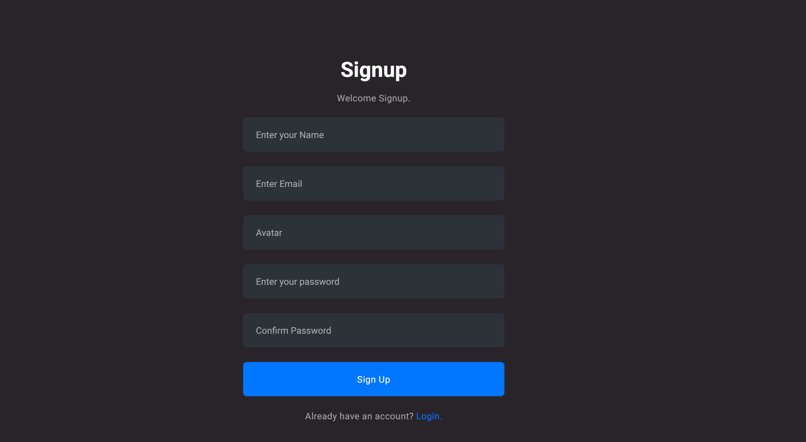
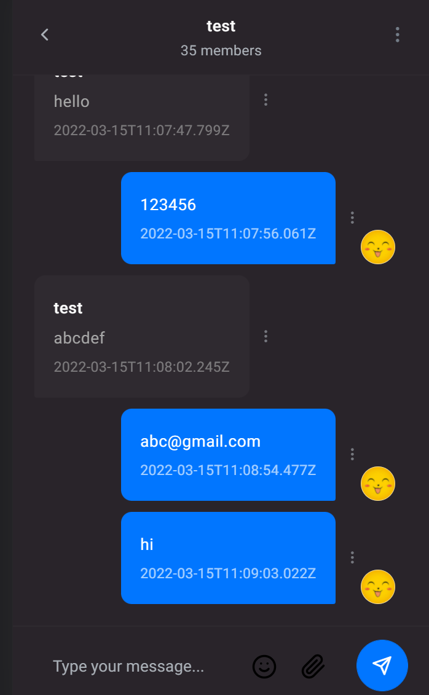

# Realtime_chat

In order to run the project, setup .env and set MONGO_URI variable equal to DB connection string.

cd client and server : run npm install to setup node_modules .

In order to avoid port collisions, in the source code port value is 8000 .

start program  : npm start

program images
 
Chat :
 

 
Login:
 

 
signup:
 

 
mobile:
 
